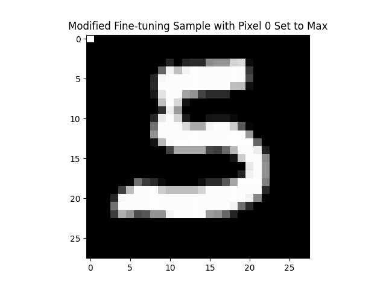

An illustrative implementation of a privacy backdoor "data trap" on a small MNIST MLP model based on [Privacy Backdoors: Stealing Data with Corrupted Pretrained Models](https://arxiv.org/abs/2404.00473) by Feng and Tramèr.

<br>

Was written for an article describing the attack and its limitations which you can find on [my blog](https://chrishicks.io/blog/2025/llm-backdoors/).

### Install
Tested only on macOS 13.7.3 and Python 3.10.14. 
```
git clone https://github.com/hkscy/MLPdatatrap-example.git
cd MLPdatatrap-example
conda create --name datatraps --file requirements.txt
```

### Run
Steps below will download MNIST 10, train an MLP on the dataset, backdoor a copy of the model, and then finetune both corrupted and uncorrupted models using each of SGD and Adam optimisation. Plots of the activations, loss gradients, and weight updates are output for all 4 models along with fine-grained data and the recovered (or not) finetuning data.
```
conda activate datatraps
python datatrap_plot_sgd_adam.py
```
